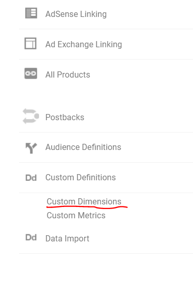
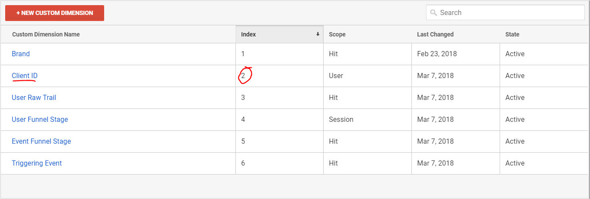
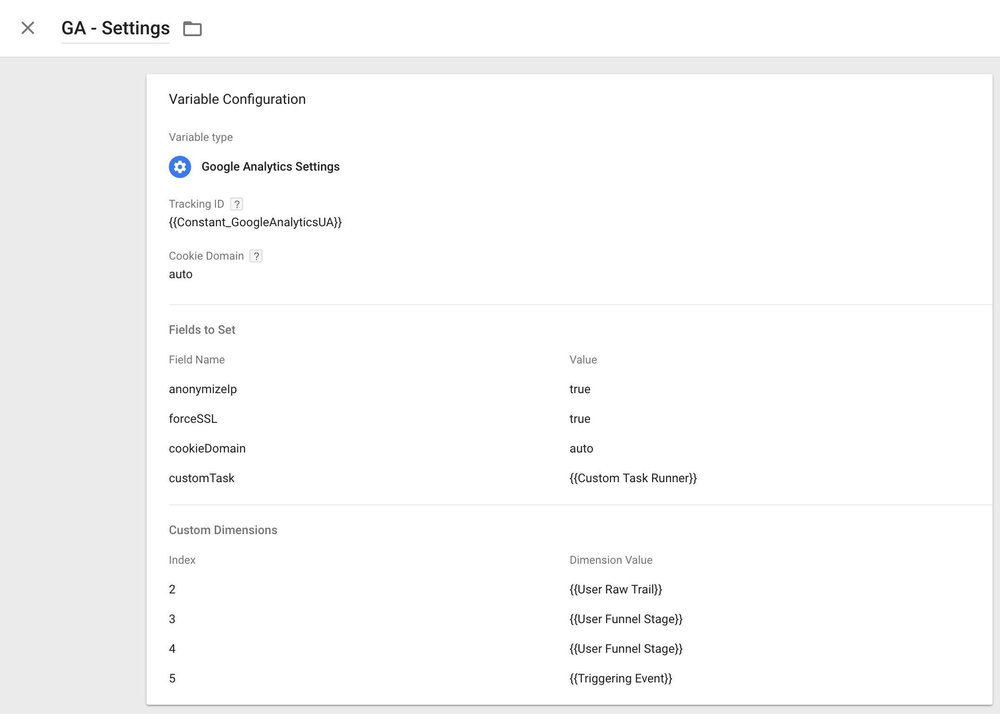
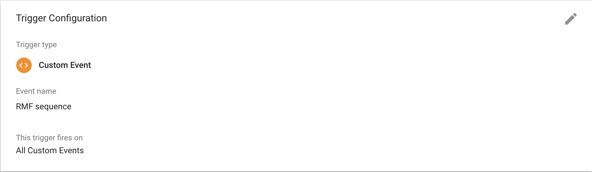
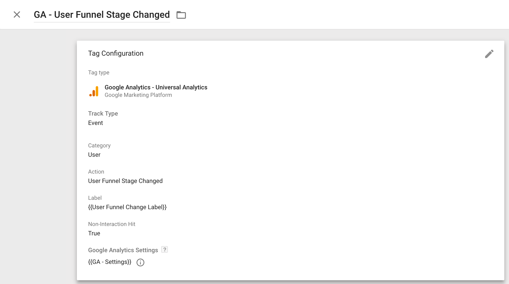
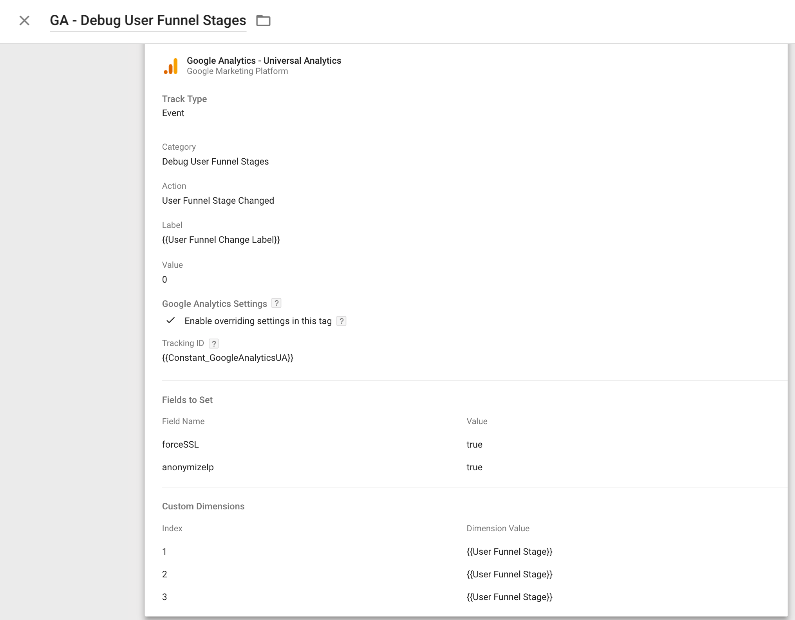

#### Outline
This repository consists of two custom javascripts, namely - events.js and measurement-framework.js.
These scripts allow for the implementation of RMF in GTM, ultimately leading to segmentation of consumers into
different "funnel stages".


#### Head-ups
Unique Google Analytics (GA) variables is used in order for the scripts to integrate properly with GA.
- In measurement-framework.js ```clientIdSetter(<index_no>)``` must be set for each GA account.
- In measurement-framework.js the userTrails section, must be modified in accordance to funnel-stage
agreements made with clients.

[](https://redperformance.no/)

#### Outline
The RED Measurement Framework (RMF) repository relies on two custom javascripts, namely - events.js and measurement-framework.js.
These scripts allow for the implementation of RMF in Google Tag Manager (GTM), ultimately leading to segmentation of consumers into different "funnel stages".

#### GTM and GA setup
*GA setup*

Unique Google Analytics (GA) variables are used in order for the script and GTM implementation to integrate properly with GA.

- In measurement-framework.js ```clientIdSetter(<index_no>)``` must be set for each GA account.
- In measurement-framework.js the userTrails section, must be modified in accordance to funnel-stage
agreements.


The following two screenshots exemplify the path you need to use in order to obtain the clientIdSetter value:






When setting the client ID, you must also remember to set the following custom dimensions:


raw user trail, user funnel stage, event funnel stage and triggering event

Finally, the following goal must be set up in Google Analytics for integrating data with datastudio.
The goal menu can be accessed through the view tab.

Goal : User Funnel Stage Changed
Goal Type : Event

- Raw user trail 
- User funnel stage 
- Event funnel stage
- Triggering event

*GTM setup*

In GTM the following steps must be done in order for RMF to be implemented correctly.

Variables to create:

- **Custom Task Runner**
	- Name : Custom Task Runner
	- Variable Type : Data Layer Variable
	- Data Layer Variable Name : customTaskRunner
	- Data Layer Version : Version 2

- **User Funnel Stage Changed**
	- Name : User Funnel Stage Changed
	- Variable Type : Data Layer Variable
	- Data Layer Variable Name : funnelStageChanged
	- Data Layer Version : Version 2	

- **User Funnel Stage**
	- Name : User Funnel Stage
	- Variable Type : Data Layer Variable
	- Data Layer Variable Name : funnelStage
	- Data Layer Version : Version 2

- **User Funnel Change Label**
	- Name : User Funnel Change Label
	- Variable Type : Data Layer Variable
	- Data Layer Variable Name : funnelChangeLabel
	- Data Layer Version : Version 2

- **User Raw Trail**
	- Name : User Raw Trail
	- Variable Type : 1st Party Cookie
	- Cookie Name : rmf

- **Triggering Event**
	- Name : Triggering Event
	- Variable Type : Data Layer Variable
	- Data Layer Variable Name : eventAction
	- Data Layer Version : Version 2

- **GA settings**
	- The below screenshot documents the configuration:
	
	

Triggers to create:

- **User Funnel Stage Changed**
	- The below picture documents the configuration:
	 	

Tags to create:

- **GA - User Funnel Stage Changed**
	- The below screenshot documents the configuration:
	

- **GA - Debug User Funnel Stages**
	- The below screenshot documents the configuration:
	

For the above tags the User Funnel Stage Changed trigger, we just created, is to be used.


## Installation
A chronological list is provided below - explaining the installation of RMF:

- Make sure you have installed npm. 

- Run ```npm install i measurement-framework```
- run ```npm install``` (installing devdependencies)

- $ ```npm install i measurement-framework```
- $ ```npm install``` (installing devdependencies)


#### Compressing the measurement-framework.js code for GTM
Finally, to compress the measurement-framework.js file, type the following into
the terminal:


- run ```rollup -c```


Confirming the compression has been successful, look inside the dist folder.
If the file is there, copy its contents and make a custom html tag in the desired GTM account.

- $ ```rollup -c```

Confirming the compression has been successful, look inside the dist folder.
If the file is there, copy its contents and make a custom html tag in the desired GTM account.

*GTM tag setup*


In the custom html section, type the following:

```
<script>
<between the script tags insert the copied compression of measurement-framework.js>
</script>
```

Additionally, the trigger to be used is "All Pages"

## 

Additionally, the trigger to be used is "All Pages". Finally, pick and awesome name for your RMF tag.

## [](https://redperformance.no/)

